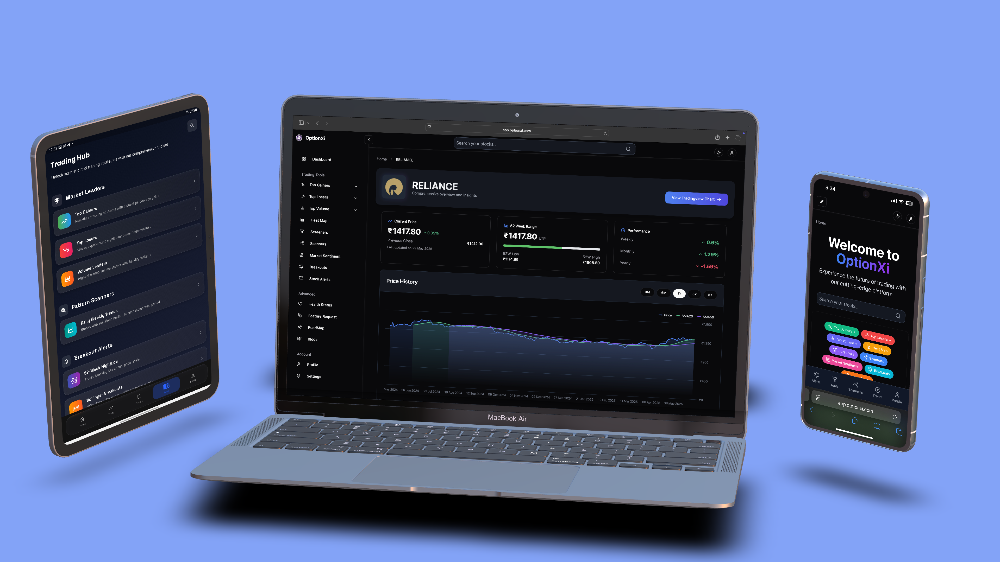

# OptionXI Web – Open Source Virtual Trading Platform

[](https://github.com/optionxi/optionxi-web/actions/workflows/build.yml)

[](https://github.com/optionxi/optionxi-webapp-community/actions/workflows/gitleaks.yml)


**OptionXI Web** is **India's first open-source virtual trading platform** — now available as a responsive **web application** built with **Next.js** and **Supabase**.

> ⚠️ *This repository contains the source code for the **web version** of OptionXI. The Flutter mobile app is available in [optionxi-flutter-community](https://github.com/optionxi/optionxi-flutter-community).*
> Visit the live app here: [https://app.optionxi.com](https://app.optionxi.com)

---

## 🌟 [Web App Preview](https://app.optionxi.com)




🔗 [Click here to see the web app](https://app.optionxi.com)

---

## 🚀 What is OptionXI?

**OptionXI** is a powerful, easy-to-use virtual trading platform that uses **real Indian stock market data**. Whether you're a beginner or an experienced trader, OptionXI provides an educational space to:

* Practice trades with no financial risk
* Test out trading strategies
* Learn and contribute to a transparent, open-source ecosystem

---

## 🔑 Key Features

* ✅ **Virtual Trading**

  * Simulate trades in NIFTY 50, BankNIFTY, and Options
  * Based on real or previous day market data
  * Paper trading and backtesting capabilities

* 📊 **Stock Screeners**

  * Scan stocks by volume, performance, or price movement
  * Discover opportunities and plan trades

* 🛎️ **Alerts & Watchlists**

  * Save your favorite tickers
  * Get price movement alerts in real time

* 📈 **Charts & Insights**

  * Detailed charts, stock data, and option chains
  * Visualize and analyze trading decisions

* 🧠 **Educational Focus**

  * No real money involved — safe for learners
  * Ideal for students, beginners, and fintech enthusiasts

* 🤖 **Coming Soon: Algorithmic Trading**

  * Strategy-based trading bots
  * Automation and backtest tools

---

## 🌐 Tech Stack

* ⚡️ **Next.js** – React framework for frontend
* 💾 **Supabase** – Postgres-powered backend with Realtime and Auth
* 📡 **Cloudflare Tunnel** – For secure deployments
* 🔐 Firebase Auth (optional integration)
* 📁 Clean folder architecture and API routes

---

## 📥 Installation (Dev Setup)

```bash
git clone https://github.com/optionxi/optionxi-webapp-community.git
cd optionxi-webapp-community
cp .env.example .env.local
npm install
npm run dev
```

Required:

* Node.js 20.9+
* Supabase project credentials
* Public API keys (see `.env.example`)

Added gitleaks check
```
git config core.hooksPath .githooks
```

Increasing the buffer
```
git config http.postBuffer 524288000
```

---

## 🔓 Why Open Source?

India has a growing market of traders and educators — but many platforms lack **transparency** and **accessibility**. While some creators share real value, others exploit hype without proof.

**OptionXI is the antidote:**

* Built for **education, not profit**
* **Open-source code** and trading logic
* Public trade analysis and audit logs
* Transparent metrics and community reviews
* Anyone can suggest or test strategies

⚠️ **Note:** No real-money trading is available yet. Broker integrations may be supported in future updates.

---

## 🤝 Contributions Welcome!

Whether you're a developer, trader, or learner — join us!

* Submit features or bugs
* Improve UI/UX
* Build tools like:

  * Accuracy leaderboards
  * Strategy visualizers
  * Trade audit systems

---

## 🙌 Support the Project

OptionXI is a **community-led initiative** focused on building India’s most trusted educational trading platform.

You can support us by:

* Contributing code
* Sharing the platform
* Sponsoring us (coming soon)
* Providing feedback and suggestions

---

## 📱 Connect With Us

* 📷 Instagram: [@hi\_functioning\_sociopath](https://instagram.com/hi_functioning_sociopath)
* 🧑‍💻 GitHub: [@katmakhan](https://github.com/katmakhan)

---

## 📜 License

MIT License — Free to use, modify, and build upon.

---

## 📱 Related Projects

* [OptionXI Flutter App](https://github.com/optionxi/optionxi-flutter-community)

---

### 💬 Final Word

> "We don't need another expensive course. We need tools to help us **think, test, and learn** trading in the open."

Help us build that tool. 🛠️
Let's make stock education free, accessible, and community-driven.

---

## 🤖 AI Assistance Credits

| Logo                                                                                                                                | Platform     | Used For                   |
| ----------------------------------------------------------------------------------------------------------------------------------- | ------------ | -------------------------- |
|                                        | **ChatGPT**  | Content + Code Suggestions |
|  | **Claude**   | UI and Logic Design        |
|                                       | **DeepSeek** | Debugging                  |
|                                  | **Gemini**   | Code Testing               |

---

<div align="center">
  <em>Building the future of stock education with open tools and AI-powered efficiency.</em>
</div>